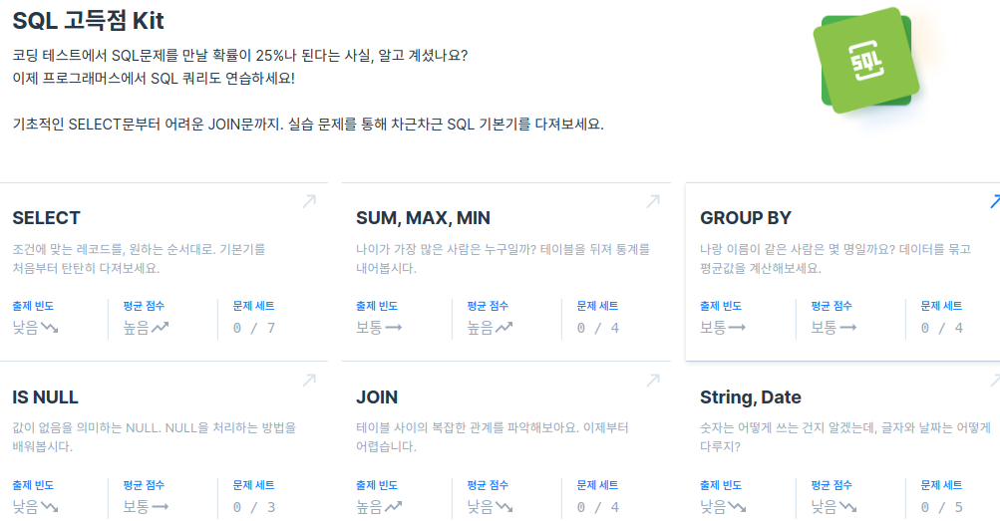

* Draft: 2020-11-27 (Fri)

# 프로그래머스

## 홈페이지

### SQL 고득점 Kit

- [ ] [모든 레코드 조회하기 Level 1 20323명 완료](https://programmers.co.kr/learn/courses/30/lessons/59034)

- [ ] [역순 정렬하기 Level 1 18410명 완료](https://programmers.co.kr/learn/courses/30/lessons/59035)

- [ ] [아픈 동물 찾기 Level 1 16978명 완료](https://programmers.co.kr/learn/courses/30/lessons/59036)

- [ ] [어린 동물 찾기 Level 1 15813명 완료](https://programmers.co.kr/learn/courses/30/lessons/59037)

- [ ] [동물의 아이디와 이름 Level 1 13346명 완료](https://programmers.co.kr/learn/courses/30/lessons/59403)

- [ ] [여러 기준으로 정렬하기 Level 1 12631명 완료](https://programmers.co.kr/learn/courses/30/lessons/59404)

- [ ] [상위 n개 레코드 Level 1 12432명 완료](https://programmers.co.kr/learn/courses/30/lessons/59405)

[SQL Tutorial](https://www.geeksforgeeks.org/sql-tutorial/), GeeksforGeeks